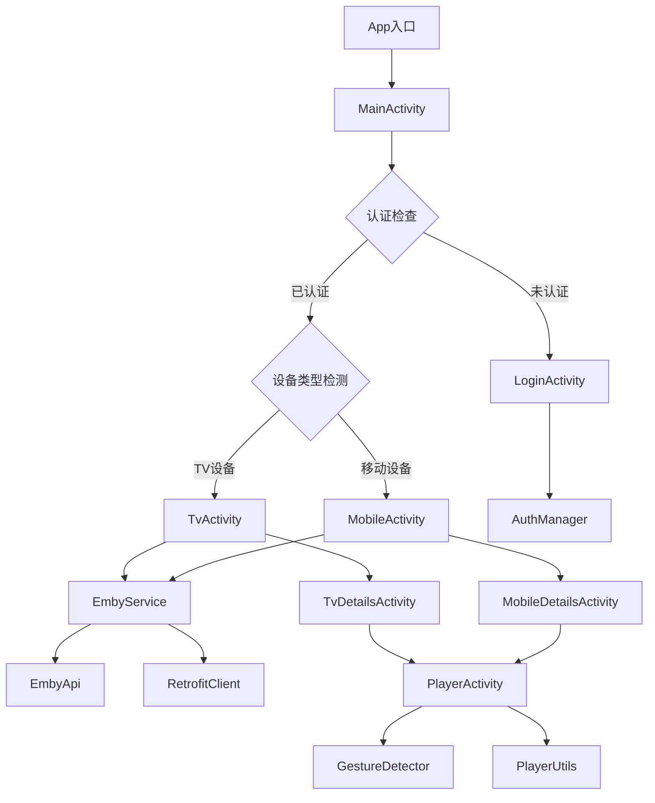

# EmbyClient Code Wiki

## 1. 仓库概览

EmbyClient是一个为Android设备（包括手机、平板、TV盒子和智能电视）设计的Emby服务器第三方客户端应用。

- **无广告** - 提供纯净的观看体验
- **API 23兼容** - 支持Android 6.0及以上版本
- **MVVM架构** - 现代且可维护的代码结构
- **单一包支持移动和TV** - 自动UI适配
- **多服务器支持** - 可添加、编辑、保存和切换多个Emby服务器
- **完整的Emby API集成** - 访问电影、电视剧、动画、收藏、继续观看、最近添加和收藏内容
- **完整的元数据显示** - 海报、背景、剧情简介、评分、演员和剧集列表
- **STRM文件支持** - 解析和播放来自NAS和Synology的STRM文件
- **播放进度同步** - 跨设备的本地和服务器端进度同步
- **高级播放器功能** - H264、H265、4K、HDR、多音轨、多字幕、速度控制和硬件/软件解码
- **触摸手势** - 在移动设备上通过滑动控制进度、音量和亮度
- **TV遥控器控制** - 完整的遥控器支持，带焦点管理

## 2. 目录结构

项目采用标准的Android应用目录结构，主要分为以下几个部分：

```
├── app/
│   ├── src/
│   │   ├── main/
│   │   │   ├── java/com/emby/client/
│   │   │   │   ├── data/           # 数据模型和认证管理
│   │   │   │   ├── network/        # 网络请求和API调用
│   │   │   │   ├── player/         # 媒体播放器实现
│   │   │   │   ├── ui/             # 用户界面
│   │   │   │   │   ├── login/      # 登录相关界面
│   │   │   │   │   ├── mobile/     # 移动设备界面
│   │   │   │   │   └── tv/         # TV设备界面
│   │   │   │   ├── utils/          # 工具类
│   │   │   │   ├── viewmodel/      # ViewModel类
│   │   │   │   ├── App.kt          # 应用入口
│   │   │   │   └── MainActivity.kt # 主活动
│   │   │   ├── res/                # 资源文件
│   │   │   └── AndroidManifest.xml # 应用清单
│   ├── build.gradle.kts            # 应用级构建配置
├── gradle/                         # Gradle包装器
├── build.gradle.kts                # 项目级构建配置
└── settings.gradle.kts             # 项目设置
```

### 主要目录说明：

| 目录/文件 | 职责 | 位置 |
|----------|------|------|
| data/ | 包含数据模型和认证管理 | [data/](file:///workspace/app/src/main/java/com/emby/client/data/) |
| network/ | 网络请求和API调用实现 | [network/](file:///workspace/app/src/main/java/com/emby/client/network/) |
| player/ | 媒体播放器实现 | [player/](file:///workspace/app/src/main/java/com/emby/client/player/) |
| ui/ | 用户界面实现，分为登录、移动和TV三个子目录 | [ui/](file:///workspace/app/src/main/java/com/emby/client/ui/) |
| utils/ | 工具类 | [utils/](file:///workspace/app/src/main/java/com/emby/client/utils/) |
| viewmodel/ | ViewModel类，实现MVVM架构 | [viewmodel/](file:///workspace/app/src/main/java/com/emby/client/viewmodel/) |

## 3. 系统架构与主流程

EmbyClient采用现代Android应用架构，主要基于MVVM（Model-View-ViewModel）模式。应用启动流程和主要组件关系如下：

### 系统架构



### 主要流程说明：

1. **应用启动**：通过`MainActivity`作为入口点，检查用户认证状态和设备类型
2. **认证流程**：未认证用户会跳转到`LoginActivity`，通过`AuthManager`管理服务器配置和认证信息
3. **设备适配**：根据设备类型（TV或移动设备）启动相应的主界面
4. **媒体浏览**：用户可以浏览媒体库、查看详情、播放媒体
5. **媒体播放**：使用`PlayerActivity`播放媒体，支持手势控制和播放进度同步

### 核心数据流：

1. **数据获取**：通过`EmbyService`调用`EmbyApi`接口获取数据
2. **数据处理**：使用`ViewModel`处理和管理数据
3. **UI更新**：根据数据更新UI界面
4. **用户交互**：处理用户操作，如播放、收藏等

## 4. 核心功能模块

### 4.1 认证管理

**功能说明**：管理用户认证信息和服务器配置，支持多服务器切换。

**实现**：通过`AuthManager`类实现，使用SharedPreferences存储服务器配置。

**主要功能**：
- 添加、更新、删除服务器配置
- 管理活动服务器
- 处理用户登录和注销

**核心代码**：[AuthManager.kt](file:///workspace/app/src/main/java/com/emby/client/data/AuthManager.kt)

### 4.2 网络请求

**功能说明**：实现与Emby服务器的通信，包括认证、获取媒体信息、报告播放进度等。

**实现**：使用Retrofit实现网络请求，通过`EmbyApi`定义API接口，`EmbyService`提供服务层封装。

**主要功能**：
- 用户认证
- 获取媒体库视图
- 获取媒体项目列表
- 获取媒体详情
- 报告播放进度
- 管理收藏

**核心代码**：[EmbyApi.kt](file:///workspace/app/src/main/java/com/emby/client/network/EmbyApi.kt)、[EmbyService.kt](file:///workspace/app/src/main/java/com/emby/client/network/EmbyService.kt)、[RetrofitClient.kt](file:///workspace/app/src/main/java/com/emby/client/network/RetrofitClient.kt)

### 4.3 媒体播放器

**功能说明**：实现媒体播放功能，支持各种格式和高级控制。

**实现**：使用ExoPlayer实现媒体播放，支持手势控制和播放进度同步。

**主要功能**：
- 播放媒体文件
- 解析和处理STRM文件
- 手势控制（进度、音量、亮度）
- 播放进度同步
- 多音轨和字幕支持

**核心代码**：[PlayerActivity.kt](file:///workspace/app/src/main/java/com/emby/client/player/PlayerActivity.kt)、[GestureDetector.kt](file:///workspace/app/src/main/java/com/emby/client/player/GestureDetector.kt)、[PlayerUtils.kt](file:///workspace/app/src/main/java/com/emby/client/player/PlayerUtils.kt)

### 4.4 用户界面

**功能说明**：提供针对不同设备类型的用户界面，包括登录、媒体浏览和详情查看。

**实现**：分为移动设备和TV设备两个不同的界面实现，自动适配设备类型。

**主要功能**：
- 登录界面
- 服务器列表管理
- 媒体库浏览
- 媒体详情查看
- 播放控制

**核心代码**：
- 登录相关：[LoginActivity.kt](file:///workspace/app/src/main/java/com/emby/client/ui/login/LoginActivity.kt)、[ServerListActivity.kt](file:///workspace/app/src/main/java/com/emby/client/ui/login/ServerListActivity.kt)
- 移动设备：[MobileActivity.kt](file:///workspace/app/src/main/java/com/emby/client/ui/mobile/MobileActivity.kt)、[MobileDetailsActivity.kt](file:///workspace/app/src/main/java/com/emby/client/ui/mobile/MobileDetailsActivity.kt)
- TV设备：[TvActivity.kt](file:///workspace/app/src/main/java/com/emby/client/ui/tv/TvActivity.kt)、[TvDetailsActivity.kt](file:///workspace/app/src/main/java/com/emby/client/ui/tv/TvDetailsActivity.kt)

## 5. 核心 API/类/函数

### 5.1 数据模型

#### ServerProfile
**说明**：服务器配置和认证信息模型
**主要属性**：
- `id`：服务器唯一标识符
- `url`：服务器URL
- `username`：用户名
- `token`：认证令牌
- `userId`：用户ID

**位置**：[Models.kt](file:///workspace/app/src/main/java/com/emby/client/data/Models.kt)

#### BaseItemDto
**说明**：媒体项目基本信息模型
**主要属性**：
- `Id`：项目ID
- `Name`：项目名称
- `Type`：项目类型
- `RunTimeTicks`：运行时间（ ticks ）
- `ImageTags`：图片标签
- `IsFolder`：是否为文件夹
- `Overview`：项目概述
- `CommunityRating`：社区评分
- `ProductionYear`：制作年份
- `UserData`：用户数据

**位置**：[Models.kt](file:///workspace/app/src/main/java/com/emby/client/data/Models.kt)

### 5.2 认证管理

#### AuthManager
**说明**：管理服务器配置和认证信息
**主要方法**：
- `getServers(context: Context)`：获取所有服务器配置
- `addServer(context: Context, server: ServerProfile)`：添加服务器配置
- `updateServer(context: Context, server: ServerProfile)`：更新服务器配置
- `removeServer(context: Context, serverId: String)`：删除服务器配置
- `getActiveServer(context: Context)`：获取当前活动服务器
- `logout(context: Context)`：注销当前服务器

**位置**：[AuthManager.kt](file:///workspace/app/src/main/java/com/emby/client/data/AuthManager.kt)

### 5.3 网络请求

#### EmbyApi
**说明**：定义与Emby服务器通信的API接口
**主要方法**：
- `authenticate(request: AuthRequest, authHeader: String)`：用户认证
- `getViews(userId: String, authHeader: String)`：获取媒体库视图
- `getItems(userId: String, parentId: String?, ...)`：获取媒体项目列表
- `getItemDetails(itemId: String, userId: String, ...)`：获取媒体项目详情
- `reportProgress(itemId: String, positionTicks: Long, ...)`：报告播放进度
- `toggleFavorite(userId: String, itemId: String, ...)`：切换收藏状态

**位置**：[EmbyApi.kt](file:///workspace/app/src/main/java/com/emby/client/network/EmbyApi.kt)

#### EmbyService
**说明**：封装Emby API调用，提供服务层功能
**主要方法**：
- `authenticate(username: String, password: String)`：用户认证
- `getViews()`：获取媒体库视图
- `getItems(parentId: String?, ...)`：获取媒体项目列表
- `getItemDetails(itemId: String)`：获取媒体项目详情
- `reportProgress(itemId: String, positionTicks: Long, ...)`：报告播放进度
- `toggleFavorite(itemId: String)`：切换收藏状态
- `getResumeItems(limit: Int?)`：获取继续观看项目
- `getRecentlyAdded(limit: Int?, ...)`：获取最近添加项目
- `getFavorites(limit: Int?)`：获取收藏项目

**位置**：[EmbyService.kt](file:///workspace/app/src/main/java/com/emby/client/network/EmbyService.kt)

#### RetrofitClient
**说明**：创建和管理Retrofit实例
**主要方法**：
- `getClient(baseUrl: String)`：获取Retrofit客户端实例

**位置**：[RetrofitClient.kt](file:///workspace/app/src/main/java/com/emby/client/network/RetrofitClient.kt)

### 5.4 播放器

#### PlayerActivity
**说明**：媒体播放器活动
**主要方法**：
- `onCreate(savedInstanceState: Bundle?)`：初始化播放器
- `onHorizontalSwipe(distance: Float)`：处理水平滑动（进度控制）
- `onVerticalSwipeLeft(distance: Float)`：处理左侧垂直滑动（亮度控制）
- `onVerticalSwipeRight(distance: Float)`：处理右侧垂直滑动（音量控制）
- `reportProgress()`：报告播放进度

**位置**：[PlayerActivity.kt](file:///workspace/app/src/main/java/com/emby/client/player/PlayerActivity.kt)

### 5.5 设备工具

#### DeviceUtils
**说明**：设备类型检测工具
**主要方法**：
- `isTv(context: Context)`：检测设备是否为TV

**位置**：[DeviceUtils.kt](file:///workspace/app/src/main/java/com/emby/client/utils/DeviceUtils.kt)

## 6. 技术栈与依赖

| 技术/依赖 | 用途 | 版本 |
|----------|------|------|
| Kotlin | 主要开发语言 | 1.9.0+ |
| Android SDK | 应用开发框架 | API 23+ |
| Retrofit | 网络请求库 | - |
| OkHttp | HTTP客户端 | - |
| Gson | JSON解析库 | - |
| ExoPlayer | 媒体播放器 | - |
| AndroidX | Android支持库 | - |
| Coroutines | 异步编程 | - |

## 7. 关键模块与典型用例

### 7.1 登录与服务器管理

**功能说明**：用户登录Emby服务器并管理多个服务器配置。

**配置与依赖**：
- 需要Emby服务器URL、用户名和密码
- 使用`AuthManager`存储服务器配置

**使用示例**：

```kotlin
// 登录并添加服务器
val authRequest = AuthRequest(username, password)
val authResponse = embyService.authenticate(authRequest)

val serverProfile = ServerProfile(
    id = UUID.randomUUID().toString(),
    url = serverUrl,
    username = username,
    token = authResponse.AccessToken,
    userId = authResponse.User.Id
)

AuthManager.addServer(context, serverProfile)
```

### 7.2 媒体浏览与播放

**功能说明**：浏览媒体库并播放媒体内容。

**配置与依赖**：
- 需要已认证的服务器配置
- 使用ExoPlayer播放媒体

**使用示例**：

```kotlin
// 获取媒体库视图
val views = embyService.getViews()

// 获取媒体项目
val items = embyService.getItems(parentId = viewId)

// 播放媒体
val playbackInfo = embyService.getPlaybackInfo(itemId)
// 提取播放URL并启动播放器
val intent = Intent(context, PlayerActivity::class.java)
intent.putExtra("playbackUrl", playbackUrl)
intent.putExtra("itemId", itemId)
startActivity(intent)
```

### 7.3 播放控制与进度同步

**功能说明**：控制媒体播放并同步播放进度到服务器。

**配置与依赖**：
- 使用ExoPlayer控制播放
- 使用Emby API报告进度

**使用示例**：

```kotlin
// 播放器监听
player.addListener(object : Player.Listener {
    override fun onPositionDiscontinuity(reason: Int) {
        super.onPositionDiscontinuity(reason)
        reportProgress()
    }

    override fun onIsPlayingChanged(isPlaying: Boolean) {
        super.onIsPlayingChanged(isPlaying)
        reportProgress()
    }
})

// 报告进度
private fun reportProgress() {
    val positionTicks = player.currentPosition * 10000 // 转换为ticks
    val isPaused = !player.isPlaying
    
    CoroutineScope(Dispatchers.IO).launch {
        embyService.reportProgress(itemId, positionTicks, isPaused, playSessionId)
    }
}
```

## 8. 配置、部署与开发

### 8.1 开发环境配置

**Prerequisites**：
- Android Studio 2023.1.1 或更高版本
- Java 17 或更高版本
- Kotlin 1.9.0 或更高版本

**构建步骤**：
1. 克隆仓库：`git clone https://github.com/Afushu/EmbyClient.git`
2. 在Android Studio中打开项目
3. 同步项目与Gradle文件
4. 构建项目：
   - 移动设备：`./gradlew assembleDebug`
   - TV设备：相同的构建适用于移动和TV
5. 在设备或模拟器上运行应用

### 8.2 应用配置

**主要配置文件**：
- `AndroidManifest.xml`：应用清单，定义活动和权限
- `build.gradle.kts`：构建配置

**权限要求**：
- 网络访问权限
- 存储访问权限（用于STRM文件）

## 9. 监控与维护

### 9.1 日志与调试

应用使用OkHttp的HttpLoggingInterceptor记录网络请求日志，便于调试API调用问题。

**日志级别**：BODY级别，记录完整的请求和响应。

### 9.2 常见问题与解决方案

| 问题 | 可能原因 | 解决方案 |
|------|---------|----------|
| 无法连接到服务器 | 服务器URL错误或网络问题 | 检查服务器URL和网络连接 |
| 登录失败 | 用户名或密码错误 | 检查登录凭据 |
| 播放失败 | 媒体格式不支持或网络问题 | 检查媒体格式和网络连接 |
| STRM文件解析失败 | STRM文件格式错误 | 检查STRM文件内容 |

## 10. 总结与亮点回顾

EmbyClient是一个功能完整、架构现代的Emby服务器第三方客户端，具有以下亮点：

1. **统一代码库**：单一代码库支持移动和TV设备，通过自动检测设备类型提供适配的UI体验
2. **完整的API集成**：实现了Emby服务器的核心API，支持媒体浏览、播放和同步
3. **高级播放器功能**：支持多种格式、多音轨、多字幕和硬件解码
4. **用户友好的控制**：移动设备上的手势控制和TV设备上的遥控器支持
5. **多服务器管理**：支持添加、编辑和切换多个Emby服务器
6. **STRM文件支持**：能够解析和播放来自NAS和Synology的STRM文件
7. **播放进度同步**：自动同步播放进度到服务器，实现跨设备续播
8. **现代架构**：采用MVVM架构和Kotlin协程，代码结构清晰可维护

EmbyClient为用户提供了一个无广告、功能完整的Emby服务器客户端，适用于各种Android设备，是Emby生态系统中的重要补充。